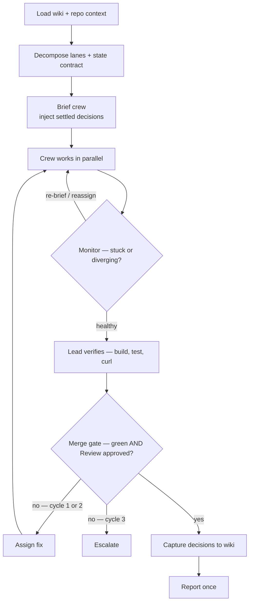

# retinue

**An autonomous lead and a crew for Claude Code, with a memory that outlives the session.**

*retinue* — the staff who attend someone, letting one person operate at a scale one person
shouldn't manage.

Two problems, one system. Coding agents forget everything between sessions, so every morning starts
by re-explaining decisions you already made. And a solo developer can parallelize work across
several agents right up until the moment coordinating them costs more than doing it alone.

Retinue fixes both by joining them: **a lead agent that supervises a crew to completion**, standing
on **a compiled wiki it reads at the start of a run and writes back to at the end**.

---

## The run loop



The loop has two exits, and both matter more than the happy path.

**The fix cycle is bounded.** A failed merge gate sends work back with a specific assignment — at
most twice for the same finding. A third attempt is thrash, not persistence, so it escalates
instead. Unbounded retry is how autonomous runs burn a night and a budget on one bug.

**The lead verifies rather than trusts.** An agent reporting success is a claim. The lead runs the
build, the tests, and the endpoint itself before merging anything, and it writes no source code —
gaps get assigned to a crew member, never patched by the supervisor.

## What the lead may decide

"Run until done" is only safe with a written edge. Autonomy without an escalation policy is just an
unattended process with file-write access.

| Decides silently | Decides, then records | Stops and asks |
|---|---|---|
| Naming, file layout, test structure | Architecture inside the stated scope | `DROP` / `TRUNCATE` / `DELETE` without `WHERE` |
| Rejecting work, re-briefing, reassigning | Contract changes between lanes | Destructive migrations |
| Non-destructive refactors | Trade-offs it had to resolve | Deleting files it did not create |
| Retrying a failed agent | Anything a future run should inherit | Scope growth · 3rd fix cycle · budget cap |

The right-hand column goes into **every crew brief**, not just the playbook — a subagent is not
bound by a document it never read.

## The memory half

Most agent-memory tools stop at "store markdown, index it." The interesting question is not storage,
it's **reach**: a knowledge base nothing loads is a knowledge base that decays.

So the wiki is wired into both ends of a run. At the start the lead pulls the decisions touching this
repo and puts them in every brief, so nobody re-litigates a settled architecture call. At the end it
writes what was decided back — with typed edges, not bare links:

```markdown
## Relations

- supersedes::[[decisions/2026-07-18-monolith-first]]
  - The monolith call stands; treating the old system as a spec does not.
- derived_from::[[raw/2026-07-19-domain-notes]]
- contradicts::[[concepts/some-opposing-view]]
```

A bare `[[link]]` says two pages are related and nothing more. `supersedes::` tells an agent which
one to believe — and gives the edge a direction it never had. Nothing is ever silently overwritten:
the superseded page stays, annotated. A knowledge base that never records where it changed its mind
decays into confident averages.

## Watching a run

A team run is opaque while it happens: three agents editing files in parallel, and a lead that
reports once, at the end. `retinue watch` renders it as it goes.

```bash
go run ./cmd/retinue watch                        # newest session in this repo
go run ./cmd/retinue watch --repo ~/work/app --port 7777
```

It follows the session transcript and every teammate transcript beneath it, and serves a graph on
localhost — lead in marigold, crew in white, radius by tokens spent, a dot crossing the edge each
time an agent produces a message. Spawn edges come from the `Agent` tool call, report edges from its
matching result, so a lane that never came back stays visibly open instead of quietly looking done.

Each node carries **what it has cost so far**, priced per turn from the model that actually served
it — the lead and the crew often run different models, and each turn's input, output, cache reads
and cache writes bill at different rates (a 1-hour cache write costs 2× input; a 5-minute one 1.25×).
A model with no published rate is reported as unpriced rather than counted as free.

```
lane1-backend   claude-opus-4-8   3920k   $34.84
team-lead       claude-opus-5     1165k   $26.46
lane3-frontend  claude-opus-4-8   1850k   $17.90
...                                       ------
                                          $97.21
```

That is a real run. `--max-budget-usd` is only a decision you can make once you have seen this
number, and one lane costing six times another is a lane-sizing problem you want at minute five.

A run panel answers the two questions you actually have while it works — how far along, and how
long the money lasts:

```
elapsed   56m
tasks     4 of 4 done
burn      $194.15 / hr
budget    $52.79 left — 16m
```

Progress comes from the lead's own shared task list (`TaskCreate` / `TaskUpdate` in the transcript),
not from guesswork. Burn is measured over a trailing ten-minute window rather than the run's
lifetime — that run averaged $104/hr but was burning $194/hr at the end, when the most lanes were
running at once, and a lifetime average would have told you the comfortable number instead of the
true one. Pass `--budget-usd` to get the time-to-exhaustion line.

The time-remaining estimate extrapolates elapsed-per-completed-task, so it is a rough read and the
UI says so: lanes are not equal size. There is no "percent of your plan used" — your account's token
limits are not exposed anywhere on this machine, and a number invented for that line would be worse
than no line at all.

Alongside it, a rail carries the two things a graph cannot show: a rolling feed of what each agent
is actually doing — `Bash · Run the suite`, `Read · concepts/tenancy.md` — and **where knowledge
came from**.

```
read   concepts/agent-supervision-contract           lead
brief  decisions/2026-07-18-monolith-first           lane1-backend
wrote  decisions/2026-07-19-cache-ttl-tradeoff       lead
```

`read` is an agent opening a page. `brief` is the lead citing one in the prompt it wrote for a
teammate — by `[[wikilink]]` or by plain path. `wrote` is the run feeding the wiki back at the end.
The distinction is the point: a run whose knowledge column is all `read` by the lead has a wiki that
never reached the crew, which is the failure the memory half exists to prevent and the one you
cannot see from a transcript. Point `--wiki` anywhere to track a different knowledge root.

Teammates do **not** appear as `isSidechain` events in the lead transcript, which is the intuitive
guess and the wrong one; each gets its own file under `<session-id>/subagents/`, with a sidecar
holding the only copy of its human name. Both halves of a spawn and both halves of a report can
arrive in either order, so every correlation is stored from both sides.

Read-only, localhost-only, no auth. Transcripts hold full prompts and tool output; this server has
no business being reachable off the machine.

## Layout

```
CLAUDE.md              global rules — safety, scope, comment discipline, model tuning
TEAM-PLAYBOOK.md       the retinue contract: loop, supervision, merge gate, escalation
agents/                9 subagent personas — 5 modes + review/test/docs/PR
  patterns/            stack-specific code patterns, loaded on demand
skills/                /run-team, /capture, /new-app, /rfc-drafter, /review-diff
templates/             per-project CLAUDE.md template
wiki/                  the knowledge-base schema (pages gitignored — see wiki/README.md)
cmd/retinue/           the CLI — today, `retinue watch`
internal/watch/        the monitor: tailer, graph model, SSE hub, single-file UI
scripts/               shell stopgaps for what the monitor does not cover yet
settings.example.json  deny list, destructive-SQL hook, auto mode — deliberately small
install.sh             symlinks it all into ~/.claude, backing up what's there
```

The five **modes** (SWE, Frontend, PM, Designer, QA) each declare what they may and may not modify.
A frontend agent cannot touch migrations; a QA agent reports bugs and never fixes them. Scope
boundaries stop parallel agents from quietly overwriting each other.

## Install

```bash
git clone https://github.com/frahmantamala/retinue.git ~/work/retinue
cd ~/work/retinue && ./install.sh
```

Symlinks, so editing the repo takes effect immediately and `git pull` on another machine syncs your
whole setup. Existing files are backed up to `/tmp/claude-bak/` first.

`agents/`, `skills/`, and `templates/` are linked **per entry** rather than as whole directories, so
any agent or skill you keep locally but don't publish survives an install. `settings.json` is
deliberately not linked at all — it holds machine-specific state and would fight you across two
machines.

`settings.example.json` is deliberately small. Auto mode classifies each command as it arrives, so a
long `allow` list stops being a correctness requirement and becomes a per-machine, per-stack
preference — a page of Bash rules tuned for Go and Postgres is noise in a Python repo. What remains
is what no mode covers: `deny` rules, which win from any source in every mode including auto, and
the `PreToolUse` hook, which runs regardless. Add your own `allow` entries if you want to skip the
classifier on your hottest commands; that is a latency choice, not a safety one. Note that plan mode
is not a permission mechanism at all — it withholds edits until you approve a plan, and grants
nothing.

For agent teams: `export CLAUDE_CODE_EXPERIMENTAL_AGENT_TEAMS=1` and
`export CLAUDE_CODE_SUBAGENT_MODEL="claude-opus-5"`. The crew runs on Opus — capable enough that a
lane's output usually survives review, at the cost of every lane billing at lead tier. Cap unattended
runs with `--max-budget-usd`; with an Opus crew that is a requirement, not a suggestion.

## Using it

A run, end to end:

```bash
export CLAUDE_CODE_EXPERIMENTAL_AGENT_TEAMS=1
export CLAUDE_CODE_SUBAGENT_MODEL="claude-opus-5"

cd ~/work/your-app
claude            # then: /run-team, and describe the feature
```

In a second terminal, watch it work:

```bash
retinue watch --budget-usd 60
```

When it finishes, `/capture` writes what was decided into the wiki and pushes it. That is the loop —
load context, run the crew, verify, gate, record.

The pieces are also useful on their own:

| Want | Use |
|---|---|
| A multi-file feature built by a crew | `/run-team` |
| A design socialised before any code exists | `/rfc-drafter` |
| A pre-PR review of local changes | `/review-diff` |
| A new project scaffolded to the house standard | `/new-app` |
| This session's decisions written down | `/capture` |
| A specialist framing for the work at hand | `load swe` · `load frontend` · `load pm` · `load designer` · `load qa` |

**Single-threaded is a supported mode, not a failure.** A team is for *dependent, multi-file* work.
Three independent tasks want Agent View (`claude agents`); one fix wants a plain session. Matching
the mode to the dependency graph matters more than reaching for the largest one — the decision table
is in `TEAM-PLAYBOOK.md`, along with when to isolate lanes in worktrees and when not to.

Set `RETINUE_WIKI` if your knowledge base lives somewhere other than `~/work/wiki` — one export
moves the installer, every skill, and the monitor together. Two machines with different content
(work and personal, say) is a supported setup; two wikis that never cross-link is the cost.

## Portability

The substance is runner-neutral; the plumbing is not. The contract, the role definitions, the
patterns, and the wiki schema are plain markdown that any file-reading agent can follow —
`AGENTS.md` is the neutral entry point for runners that look for it (Codex, Cursor) rather than for
`CLAUDE.md`.

What is Claude Code-specific is the wiring: skill invocation, per-role model frontmatter,
`settings.json` permissions and hooks, and agent teams. `AGENTS.md` lists each one and what it maps
to elsewhere. The loop itself degrades gracefully — a runner with no crew support can follow it
single-threaded: decompose, do one lane, verify, gate, capture. Slower, not broken.

The adapters for other runners are not written yet, and I would rather ship an honest small claim
than an untested directory named `adapters/codex/`.

## What is deliberately not here

No knowledge. `wiki/` ships the schema and the three operations; the pages are gitignored, because
mine hold a client's pricing and an employer's domain knowledge and yours will hold their
equivalent. **The schema is the product.** That separation is the point — it is what makes a
knowledge base publishable at all.

Also no vector database, no embedding service, no daemon. Plain markdown, plain git, `rg` for
search. At personal scale that is not a compromise; retrieval quality is not the bottleneck,
capture is.

## Contributing

This is one person's working setup, published as a shape rather than as a product. That makes some
contributions straightforward and others a non-starter, so it is worth saying which is which.

**Welcome:** bugs in the monitor, a part of the contract that failed under a real run, an agent
persona or pattern file that generalises beyond one stack, an adapter for another runner,
documentation that was wrong or unclear.

**Not accepted:** knowledge. `wiki/` ships the schema and never pages — yours belong in your wiki,
mine in mine. Nor anything that bakes a path, a stack, or a model preference into a file meant for
everyone; `settings.example.json` is small on purpose, and the wiki root is a variable for the same
reason.

Before opening a PR:

```bash
gofmt -l .                                        # must print nothing
go build ./... && go vet ./... && go test -race ./...
shellcheck --severity=warning scripts/*.sh
```

CI runs those, plus two checks worth knowing about. The monitor's page is `go:embed`ed, so a
JavaScript syntax error in it **compiles perfectly clean** and fails only in a browser — the script
is extracted and parsed separately. And that page must stay self-contained: a CDN reference in a
localhost tool is a network dependency nobody asked for, so the build fails if one appears.

Conventions that will come up in review:

- **Comments explain why, never what.** No narrative blocks, no banners, no commented-out code.
- **Prose stays sparse.** A page that grew two topics gets split.
- **Claims are measured, not asserted.** The cost figures and the isolation rule in this README came
  from reading real transcripts. Change one and change its measurement with it.
- **Publish the shape, never the particulars.** No client or employer names, and no real session data
  in test fixtures — synthesise them. A fixture copied from a live run carries whole prompts, file
  paths, and domain vocabulary into a public repo, and nobody re-reads a fixture before merging.

## Status

Built and running. The lead contract is young — the parts most likely to need tuning are the
two-cycle fix bound and the escalation boundary, both of which only reveal themselves under real
runs.

MIT.
