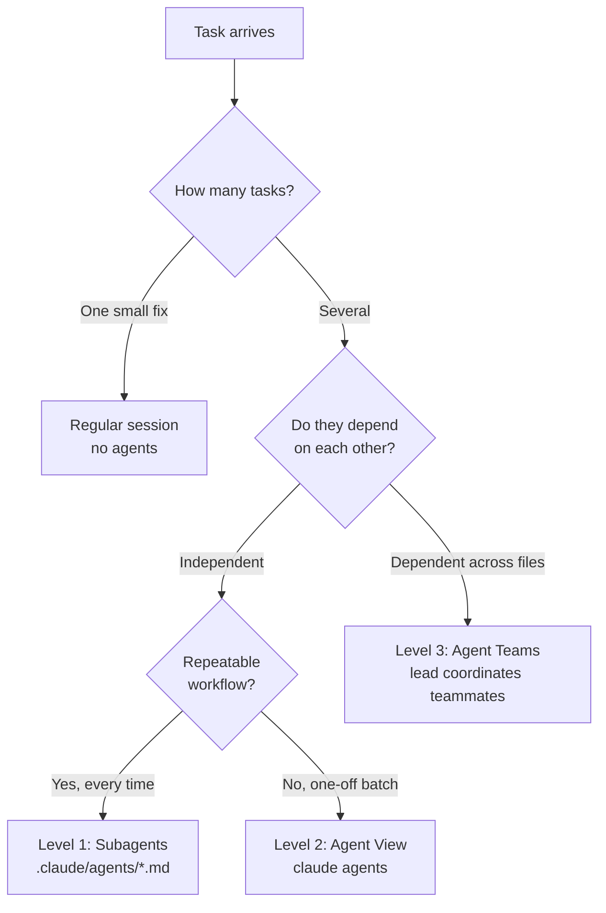
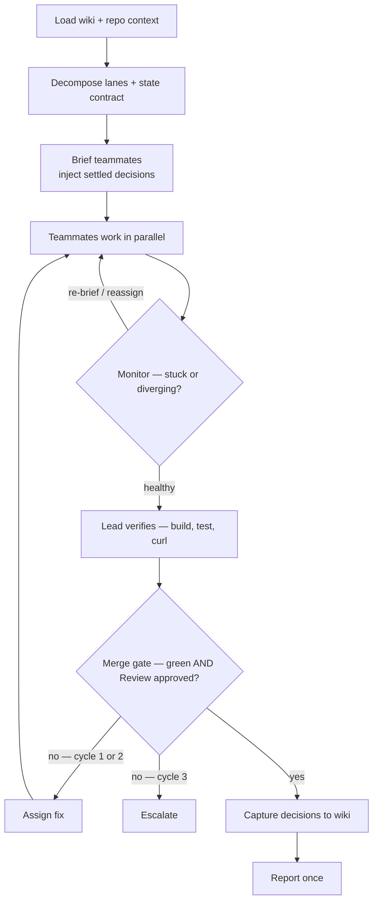

# Claude Agent Team — Playbook

Reference for choosing an orchestration mode and running teams. Concepts verified against Claude Code 2.1.167.

## The taxonomy (3 levels)



| Level | What it is | Talk to each other? | Survives terminal close? | Best for |
|------|-----------|:---:|:---:|---------|
| **1 — Subagents** | Personas the session delegates to (`.claude/agents/*.md`, or the Task tool) | No — report back to you | No (in-session) | Repeatable tasks: review, test, docs, PR |
| **2 — Agent View** | Dashboard of independent background sessions (`claude agents`) | No | **Yes** | 3–10 independent tasks, dispatch & collect |
| **3 — Agent Teams** | One lead coordinates teammates over a shared task list | **Yes** | Yes | Dependent, multi-file features |

## Decision framework (Step 6)

| Situation | Use | Command / trigger |
|-----------|-----|-------------------|
| Single prompt, single-file fix | Regular session | just prompt |
| 3 independent tasks, no deps | Agent View | `claude agents` |
| Repeatable workflow (review/test/docs/PR) | Subagent | delegate to `code-reviewer`, `test-writer`, `docs-writer`, `pr-writer` |
| Multi-file feature with dependencies | Agent Teams | team prompt (below) + `CLAUDE_CODE_EXPERIMENTAL_AGENT_TEAMS=1` |
| Overnight backlog drain | Headless | `claude -p "..." --max-budget-usd N` |

**The two failure modes:** running *independent* tasks as a team (wasted coordination overhead) or running *dependent* tasks as isolated Agent View sessions (they stomp on each other). Match the mode to the dependency graph, not the task count.

## Agents vs Skills (don't confuse them)

- **Agent** = *who* does the work. A delegated context/persona with its own tools and model. Lives in `.claude/agents/<name>.md`. The lead spawns these.
- **Skill** = *a procedure* you run in the current session, invoked as `/<name>`. Lives in `.claude/skills/<name>/SKILL.md`. No separate context; it's instructions Claude follows inline.
- Rule of thumb: **reusable steps → Skill. Parallel/isolated work → Agent.** A Skill can itself tell the lead to spawn agents (that's what `/run-team` does).

## Team prompt template

```
I need to [describe the full feature].

Spawn separate agents:
1. [Role 1]: [specific task with files/modules]
2. [Role 2]: [specific task with files/modules]
3. [Role 3]: [specific task with files/modules]
4. Review: review all code for [bugs/security/style]

Each agent works in its own context. Coordinate through the shared task list.
Flag dependencies BEFORE starting dependent tasks.
```

## The retinue contract — an autonomous lead

> *retinue*: the staff who attend someone, letting one person operate at a scale one person
> shouldn't manage. The lead directs the crew and answers for its work; its power to halt them is
> enumerated below, not improvised.

Default for a Level 3 run: the lead drives to completion without checking in. It decomposes,
briefs, supervises, verifies, and gates — and reaches you **once** at the end, or early only via
the escalation rules below. It does not ask permission to start.



### Supervision (the lead's actual job while agents run)

- **Watch, don't wait.** Poll teammate progress. An agent that has stopped making progress, wandered
  outside its lane, or started rewriting another lane's files gets re-briefed or reassigned — not left running.
- **The lead writes no source.** Not features, not glue, not `main.go` wiring, not the last bug fix.
  A remaining gap gets an agent assigned to it.
- **Verify, don't trust.** An agent reporting success is a claim. The lead runs the build, the tests,
  and the endpoint itself before believing it.

### The merge gate

A stream merges only when **the build is green AND the Review lane has approved it**. Review reports
`file:line` and never fixes. The lead never merges on a teammate's say-so.

### Bounded fix cycles

A failed gate sends work back with a specific fix assignment. **Maximum two cycles on the same
finding.** A third attempt is thrash, not persistence — escalate instead. Track cycles per finding, not per run.

### What the lead may decide

| Decides silently | Decides, then records to the wiki | Stops and asks you |
|---|---|---|
| Naming, file layout, test structure | Architecture inside the stated scope | `DROP` / `TRUNCATE` / `DELETE` without `WHERE` |
| Rejecting agent work, re-briefing, reassigning | Contract changes between lanes | Destructive migrations |
| Non-destructive refactors | Trade-offs it had to resolve | Deleting files it did not create |
| Retrying a failed agent | Anything a future run should inherit | Scope growth · 3rd fix cycle · budget cap hit |

The right-hand column is not advisory. It goes into **every teammate brief**, because
`defaultMode` is `acceptEdits` and teammates inherit it — an unattended run means agents editing
files for hours with nothing prompting. Unattended runs also require `--max-budget-usd`.

### Wiki bookends

The run starts and ends in `~/work/wiki` — that is what makes the next run cheaper than this one.

- **At start:** read `wiki/index.md`, pull decisions touching this repo, and put them in every
  teammate brief. Teammates must not re-litigate settled decisions.
- **At end:** write what was decided to `wiki/decisions/YYYY-MM-DD-slug.md` with
  `supersedes::[[...]]` edges where this run overrode an earlier call. See `~/work/wiki/CLAUDE.md`.

## Cost & safety knobs

- Teammates run on Opus via `CLAUDE_CODE_SUBAGENT_MODEL="claude-opus-5"`; lead stays on your session model. Capable crew, but every lane now costs lead-tier money — the budget cap below stops being optional.
- Always cap autonomous runs: `--max-budget-usd 15.00`.
- Guardrails live in `~/.claude/settings.json` → `permissions` (deny `git push`, `sudo`, `publish`, reading secrets). Deny always beats allow. Note: `rm` is NOT denied — the backup-before-`rm` rule in CLAUDE.md is honor-system, not enforced.

## Quick commands

```bash
claude agents                                  # Level 2 dashboard
claude -p "build X" --max-budget-usd 15.00      # headless, capped
/run-team                                       # scaffold a Level 3 team prompt
/review-diff                                    # delegate current diff to code-reviewer
```
