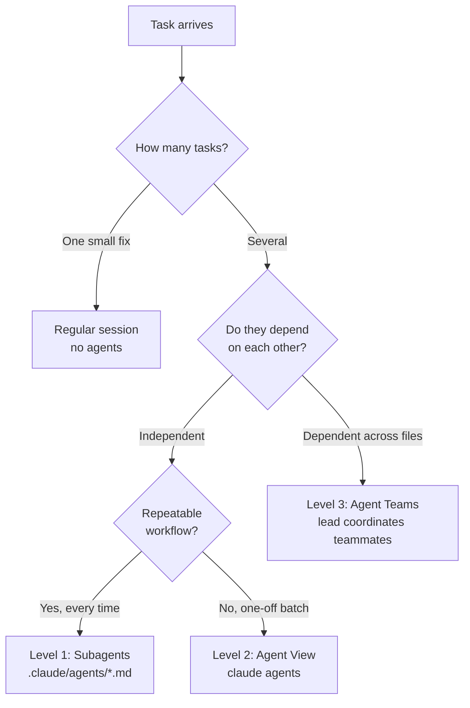
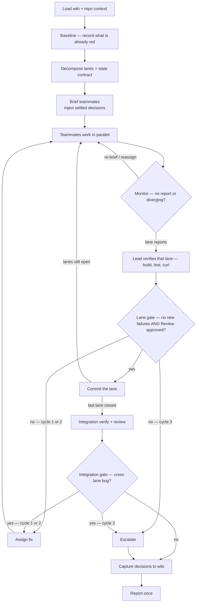

# Claude Agent Team — Playbook

Reference for choosing an orchestration mode and running teams. Concepts verified against Claude Code 2.1.167.

## The taxonomy (3 levels)



| Level | What it is | Talk to each other? | Survives terminal close? | Best for |
|------|-----------|:---:|:---:|---------|
| **1 — Subagents** | Personas the session delegates to (`.claude/agents/*.md`, or the Task tool) | No — report back to you | No (in-session) | Repeatable tasks: review, test, docs, PR |
| **2 — Agent View** | Dashboard of independent background sessions (`claude agents`) | No | **Yes** | 3–10 independent tasks, dispatch & collect |
| **3 — Agent Teams** | One lead coordinates teammates over a shared task list | **Yes** | Yes | Dependent, multi-file features |

## Decision framework (Step 6)

| Situation | Use | Command / trigger |
|-----------|-----|-------------------|
| Single prompt, single-file fix | Regular session | just prompt |
| 3 independent tasks, no deps | Agent View | `claude agents` |
| Repeatable workflow (specs/review/test/docs/PR) | Subagent | delegate to `pm`, `code-reviewer`, `test-writer`, `docs-writer`, `pr-writer` |
| Multi-file feature with dependencies | Agent Teams | team prompt (below) + `CLAUDE_CODE_EXPERIMENTAL_AGENT_TEAMS=1` |
| Overnight backlog drain | Headless | `claude -p "..." --max-budget-usd N` |

**The two failure modes:** running *independent* tasks as a team (wasted coordination overhead) or running *dependent* tasks as isolated Agent View sessions (they stomp on each other). Match the mode to the dependency graph, not the task count.

## Where the work happens (isolation)

The framework above picks *who* works; this picks *where*. Independent axes — a team can run in one
tree or in several.

| Situation | Isolation | How |
|-----------|-----------|-----|
| One branch, many files (a team's lanes) | None — scope discipline | each lane owns disjoint paths |
| Two live branches (PR feedback + a new feature) | One worktree per branch | `git worktree add ../<repo>-<branch> <branch>` for a branch that exists; `claude --worktree` for a new one |
| Competing attempts at the *same* task | Per-agent worktree | `Agent(..., isolation: "worktree")` |

**Default to none.** Measured on a real 8-agent run: 79 file writes, zero overlap between agents. The
scope table already prevents collisions, and worktrees cost setup, disk, and the lead's ability to
verify everything in one tree. They also sever cross-lane dependencies — a lane blocked on another
lane's endpoints cannot see that lane's code from a separate worktree.

**Reach for worktrees when branches multiply, not when files do.** One checkout holds one branch, so
two concurrent branches need two directories. Stash-and-switch is not the alternative while agents
are live: switching the branch under a running session invalidates every file it has read, silently
and with no error.

Three traps:

- **Worktrees isolate code, not runtime.** A shared Postgres, port, or compose stack still collides —
  and migrations from one branch land in the database the other is testing against. Give each its own
  compose project name and ports, or run the stack in one worktree only.
- **`baseRef` defaults to `fresh`**, branching from `origin/<default-branch>` rather than local HEAD.
  Commit locally without pushing and the agent starts behind you. Set `worktree.baseRef: "head"`.
- **`claude --worktree` creates a *new* branch.** For PR feedback you want the branch that already
  carries the review comments — add it as a worktree instead.

Set `worktree.symlinkDirectories: ["node_modules"]` so each worktree doesn't pay a fresh install.

## Agents vs Skills (don't confuse them)

- **Agent** = *who* does the work. A delegated context/persona with its own tools and model, spawned by the lead. Lives in `.claude/agents/<name>.md` **with `name`/`description`/`model`/`tools` frontmatter** — that frontmatter is what registers it as spawnable. Every file in `agents/` registers one; there is no second kind.
- **Skill** = *a procedure* you run in the current session, invoked as `/<name>`. Lives in `.claude/skills/<name>/SKILL.md`. No separate context; it's instructions Claude follows inline.
- Rule of thumb: **reusable steps → Skill. Parallel or isolated work → Agent.** A Skill can itself tell the lead to spawn agents (that's what `/run-team` does).

## Team prompt template

```
I need to [describe the full feature].

Spawn separate agents:
1. [Role 1]: [specific task with files/modules]
2. [Role 2]: [specific task with files/modules]
3. [Role 3]: [specific task with files/modules]

Gate each stream with a fresh code-reviewer as it lands, and one over the combined
diff at the end. Each agent works in its own context. Coordinate through the shared task list.
Flag dependencies BEFORE starting dependent tasks.
```

Every lane maps to a registered agent — spawn that one, don't re-explain its scope in the brief:

| Lane | Agent | Owns |
|------|-------|------|
| Requirements | `pm` | `.md` only — stories, acceptance criteria, risks (runs *first and alone*, before lanes are cut — not a lane) |
| Backend | `backend` | server code, migrations, API contracts, backend tests |
| Frontend | `frontend` | components, styles, stores, frontend tests |
| Testing | `test-writer` | test files only |
| Docs | `docs-writer` | `.md` only |
| Review | `code-reviewer` | nothing — reports `file:line` (spawned fresh per stream at gate time, not a standing lane) |
| PR | `pr-writer` | nothing — drafts title/body (spawned after the tree is green, not a standing lane) |

Fall back to `general-purpose` only for a lane none of these covers.

## The retinue contract — an autonomous lead

> *retinue*: the staff who attend someone, letting one person operate at a scale one person
> shouldn't manage. The lead directs the crew and answers for its work; its power to halt them is
> enumerated below, not improvised.

Default for a Level 3 run: the lead drives to completion without checking in. It decomposes,
briefs, supervises, verifies, and gates — and reaches you **once** at the end, or early only via
the escalation rules below. It does not ask permission to start.



### Supervision (the lead's actual job while agents run)

- **Poll the task list.** Between reports the lead sees no teammate output; what it *can* read is
  `TaskList` — status and owner, no timestamps. A task `in_progress` whose owner has produced no
  report across two consecutive polls gets a `SendMessage` status ping — that is how a lead reaches a
  teammate — then a re-brief or reassign, same as for one that wandered out of lane. `retinue watch`
  is the human's view; nothing in the loop waits on someone reading it.
- **Spend against the cap, not into it.** No subcommand reports run cost, so this one is the human's
  call from `retinue watch` and the lead acts on being told: at 70% of `--max-budget-usd` with lanes
  still open, stop spawning — no new lanes, no replacement agents — and drive the open lanes to a
  gate. Lane cost spreads several-fold on real runs; one runaway lane starves the ones behind it.
- **The lead writes no source.** Not features, not glue, not `main.go` wiring, not the last bug fix.
  A remaining gap gets an agent assigned to it.
- **Verify, don't trust.** An agent reporting success is a claim. The lead runs the build, the tests,
  and the endpoint itself before believing it.

### The merge gate

Lanes share one tree (see *Where the work happens*), so a teammate's work is in the working files the
moment it reports — there is nothing to withhold. "Merge" is therefore something the lead *does*: **a
commit**. Teammates run no `git` state commands; the lead owns the tree.

A lane gates on *no new failures against the baseline* — build and suite run before anything spawned
— AND approval from a `code-reviewer` spawned fresh for it. The lead then stages that lane's paths
(`git add -- <paths>`; a lane's new files are untracked and `git commit -- <path>` would reject them)
and commits them — **never `-a`, never a bare `git commit`**, which in a shared tree sweeps a
neighbour's half-finished work into the record and destroys the `git revert` boundary the gate exists
for. Gate each lane as it reports, not after the crew finishes; when the last lane commits, one
integration reviewer reads the combined diff and the lead re-runs the full suite — that review gates
too, its findings going back to the owning lane under the same bound. Review reports `file:line` and
never fixes.

### Bounded fix cycles

A failed gate sends work back with a specific fix assignment. **Maximum two cycles on the same
finding** — tracked per finding, not per run, and keyed on normalised `file:line` + category from the
reviewer's report, or the same bug reworded reads as new and the bound leaks silently. A third
attempt is thrash, not persistence: escalate, and capture before reporting — the run that thrashed is
the run that learned the most.

### What the lead may decide

| Decides silently | Decides, then records to the wiki | Stops and asks you |
|---|---|---|
| Naming, file layout, test structure | Architecture inside the stated scope | `DROP` / `TRUNCATE` / `DELETE` without `WHERE` |
| Rejecting agent work, re-briefing, reassigning | Contract changes between lanes | Destructive migrations |
| Non-destructive refactors | Trade-offs it had to resolve | Deleting files it did not create |
| Retrying a failed agent | Anything a future run should inherit | Scope growth · 3rd fix cycle · budget cap hit |

The right-hand column is not advisory. It goes into **every teammate brief**, because
`defaultMode` is `acceptEdits` and teammates inherit it — an unattended run means agents editing
files for hours with nothing prompting. Unattended runs also require `--max-budget-usd`.

### Wiki bookends

The run starts and ends in the wiki (`$RETINUE_WIKI`, default `~/work/wiki`) — that is what makes the next run cheaper than this one.

- **At start:** read `wiki/index.md`, pull decisions touching this repo, and put them in every
  teammate brief. Teammates must not re-litigate settled decisions.
- **At end:** write what was decided to `wiki/decisions/YYYY-MM-DD-slug.md` with
  `supersedes::[[...]]` edges where this run overrode an earlier call. See the schema at `$RETINUE_WIKI/CLAUDE.md`.

## Cost & safety knobs

- Teammates run on Opus via `CLAUDE_CODE_SUBAGENT_MODEL="claude-opus-5"`; lead stays on your session model. Capable crew, but every lane now costs lead-tier money — the budget cap below stops being optional.
- Always cap autonomous runs: `--max-budget-usd 15.00`.
- Guardrails live in `~/.claude/settings.json` → `permissions` (deny `git push`, `sudo`, `publish`, reading secrets). Deny always beats allow. Note: `rm` is NOT denied — the backup-before-`rm` rule in CLAUDE.md is honor-system, not enforced.

## Quick commands

```bash
claude agents                                  # Level 2 dashboard
claude -p "build X" --max-budget-usd 15.00      # headless, capped
/run-team                                       # scaffold a Level 3 team prompt
/review-diff                                    # delegate current diff to code-reviewer
```
